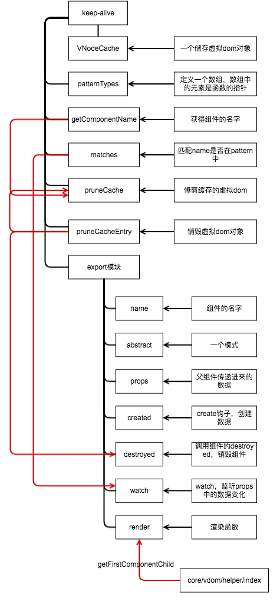

## 前言
- vue中有一个内置组件就是keep-alive组件，这个组件自身不会被渲染成一个Dom对象，也不会监听任何事件
## 流程图

## keep-alive的实现
- 既然是内置组件，就应该有组件的生命周期等一些特性，在源码中是这样的，我们一部分一部分的看
```js
export default {
  name: 'keep-alive',   //名字keep-alive
  abstract: true,   //不渲染成dom元素，也不监听任何事件，抽象组件的意思。

  props: {
    ...
  },

  created () {
    ...
  },

  destroyed () {
    ...
  },

  watch: {
    ...
  },

  render () {
    ...
  }
}
```
- props
```js
props: {
//从父组件传递进来的数据
include: patternTypes,
//字符串或正则表达式。只有匹配的组件会被缓存。
exclude: patternTypes
//字符串或正则表达式。任何匹配的组件都不会被缓存。
},
```
> 这里用的是TypeScript的语法，意思是include和exclude必须是patternType类型的，那什么是patternTypes类型呢？源码中是这样解释的

```js
const patternTypes: Array<Function> = [String, RegExp, Array]    // 定义一个数组，数组中的元素是函数的指针
```
> 这样我们就清晰很多，字符串，正则，数组中的一个，所以，官网给出的keep-alive中有这么一段

```html
<!-- 逗号分隔字符串 -->
<keep-alive include="a,b">
  <component :is="view"></component>
</keep-alive>
<!-- 正则表达式 (使用 `v-bind`) -->
<keep-alive :include="/a|b/">
  <component :is="view"></component>
</keep-alive>
<!-- 数组 (使用 `v-bind`) -->
<keep-alive :include="['a', 'b']">
  <component :is="view"></component>
</keep-alive>
```
- created
```js
created () {
//创建一个空对象
    this.cache = Object.create(null)
},
```
> created的生命钩子是数据挂载的时候，尤大在这个钩子里面创建了一个cache对象,Object.create(null)这是在js中经常使用的手段，应为这个创建的对象，比{}还要空，有兴趣的可以自己谷歌一下

- destroyed
```js
destroyed () {
//遍历缓存的数据，并调用pruneCacheEntry，去销毁this.cache对象
    for (const key in this.cache) {
        pruneCacheEntry(this.cache[key])
    }
},
```
> 这个生命钩子是组件被销毁的生命钩子，这里面有一个pruneCacheEntry函数，我们可以来看一下，他是实现什么功能的

```js
function pruneCacheEntry (vnode: ?VNode) {
  //传入一个虚拟dom对象
  if (vnode) {
    //如果有这个对象
    vnode.componentInstance.$destroy()
    //调用对象组件中销毁接口
  }
}
```
> 这个函数中传入的是一个对象调用对象destroy的生命钩子，可以去销毁他

> 所以我们可以知道当keep-alive这个组件别销毁之后，缓存的对象也会随之销毁

- watch
```js
watch: {
  //当include中的值发生变化时，会触发prunecache函数
  include (val: string | RegExp | Array<string>) {
    pruneCache(this.cache, this._vnode, name => matches(val, name))
  },
  exclude (val: string | RegExp | Array<string>) {
    pruneCache(this.cache, this._vnode, name => !matches(val, name))
  }
},
```
> watch这个是检测props中的数据的变化的，当include和exclude的值发生变化时，值的类型还是上述三种，我们会调用pruneCache函数，但是调用之前，我们先来看一下matches函数

```js
function matches (pattern: string | RegExp | Array<string>, name: string): boolean {
  //传入pattern，类型是字符串或正则或者字符串数组，传入名字字符串，返回布尔值
  if (Array.isArray(pattern)) {
    //检查pattern变量是否是数组
    return pattern.indexOf(name) > -1
    //如果是，就看name是否在数组中，在的返回true，不再返回false
  } else if (typeof pattern === 'string') {
    //检测类型是否是字符串
    return pattern.split(',').indexOf(name) > -1
    //将其分割，存入数组中，之后查找那么是否在分割后的数组中，在的返回true，不再返回false
  } else if (isRegExp(pattern)) {
    //判断他是否是正则
    return pattern.test(name)
    //测试name是否在其中
  }
  /* istanbul ignore next */
  return false
  //如果都不是返回false
}
```
> matches函数的作用就是判断name是否在pattern中，如果在其中返回的是true，不在其中，返回的是false

```js
function pruneCache (cache: VNodeCache, current: VNode, filter: Function) {
  //传入的第一个参数是缓存对象，原本的对象，一个filter函数,其实就是上述的matches函数
  for (const key in cache) {
    //遍历缓存对象
    const cachedNode: ?VNode = cache[key]
    //cacheNode是缓存对象中的一项
    if (cachedNode) {
      //如果cachedNode不为空
      const name: ?string = getComponentName(cachedNode.componentOptions)
      //获取组件的名字
      if (name && !filter(name)) {
        //这里的filter其实是match函数，因为可以从下面可以看出，返回的是一个布尔值
        if (cachedNode !== current) {
          //如果缓存的不等于正确的，就是组件已经更新了，就把原来的销毁掉
          pruneCacheEntry(cachedNode)
        }
        //将全局变量cache变成null
        cache[key] = null
      }
    }
  }
}
```

> 这个函数的大致作用就是判断缓存组件中的每一项，当缓存中的每一项，又和正确是是否相同，如果不相同的话调用pruneCacheEntry函数销毁他，这里面有一个getComponentName函数，我们来看一下这个是用来干什么的？

```js
function getComponentName (opts: ?VNodeComponentOptions): ?string {
    // 接收的类型是VNodeComponentOptions，返回的是字符串类型
  return opts && (opts.Ctor.options.name || opts.tag)
  //这里面时一个短路操作，当opts为真时，里面又是一个短路操作，当opts.Ctor.options.name为真时，返回opts.Ctor.options.name，当opts.Ctor.options.name为假时，返回opts.tag。
  // componentOptions包含五个元素{ Ctor, propsData, listeners, tag, children }
}
```
- render
```js
render () {
  const vnode: VNode = getFirstComponentChild(this.$slots.default)
  //getFirstComponentChild这个函数等会再说，他的主要作用就是获取this.$slots.default的第一个子元素
  const componentOptions: ?VNodeComponentOptions = vnode && vnode.componentOptions
  //这是一个js的短路操作，当vnode为真时，componentOptions等于vnode.componentOptions
  if (componentOptions) {
    // check pattern
    const name: ?string = getComponentName(componentOptions)
    //获取opts.Ctor.options.name元素
    if (name && (
      (this.include && !matches(this.include, name)) ||
      (this.exclude && matches(this.exclude, name))
      //如果匹配到exclude中，或者没有匹配到include中，就直接返回，不缓存
    )) {
      return vnode
    }
    //接下来进行缓存操作
    const key: ?string = vnode.key == null
      ? componentOptions.Ctor.cid + (componentOptions.tag ? `::${componentOptions.tag}` : '')
      : vnode.key
      //当vnode.key为null时，key等于前者，否则等于后者，前者有分两种情况，componentOptions.tag为真时，componentOptions.Ctor.cid::componentOptions.tag的值，否则为componentOptions.Ctor.cid
    if (this.cache[key]) {
      //如果缓存中有这个健值对，就把对象中元素的componentInstance等于缓存中componentInstance
      vnode.componentInstance = this.cache[key].componentInstance
    } else {
      //否者，缓存虚拟对象
      this.cache[key] = vnode
    }
    vnode.data.keepAlive = true
    //吧对象中一个keepAlive设置为true代表以缓存
  }
  return vnode
}
```

- 总结，源码看完了，我们总结一下
1、在自己的代码中，可以用短路操作的，尽量用短路操作，这样可以美化代码
2、当组件销毁时，记得吧组件中的变量一并销毁，这样可以保证安全
3、从源码中，我们可以看出vue文档中为什么只接受String, RegExp, Array，String还需要用逗号隔开
4、写代码的时候，要把方法函数单独拎出来写，这样可以强化代码的复用
